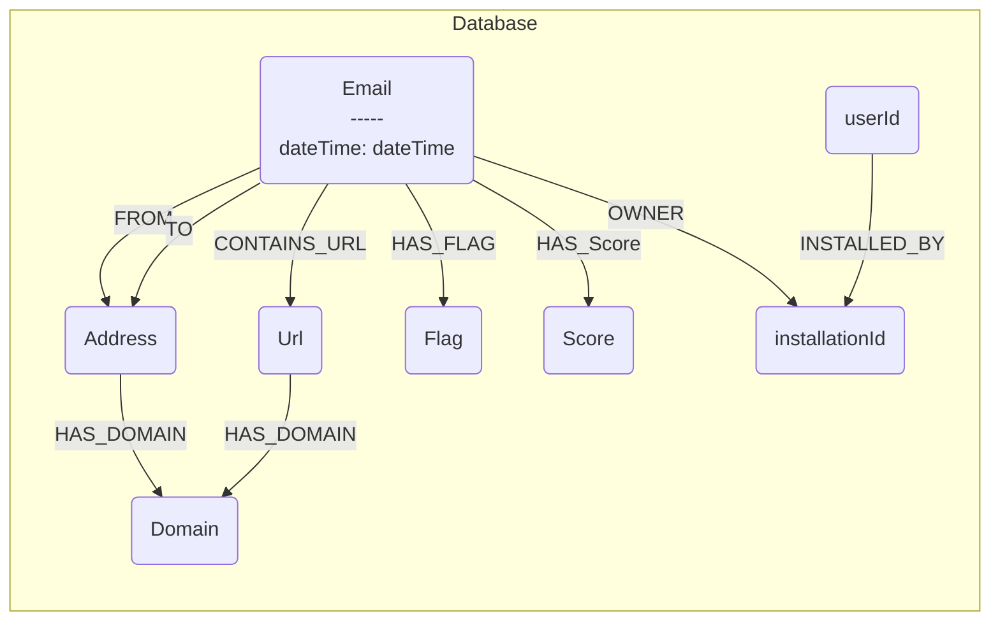

# Harbour

Harbour serves as the centralized database for collecting data from the rest of the product.

## Overview

Harbour runs a Neo4j graph database instance and an API server using Docker Compose. The database acts as the central data collection point for the application, and the API server translates JSON payloads from the Chrome extension into Neo4j graph operations.

## Database Configuration

The Neo4j database is configured with:

- **Image**: `neo4j:latest`
- **Container Name**: `neo4j`
- **Ports**:
  - `7474`: HTTP interface (Neo4j Browser)
  - `7687`: Bolt protocol (database connections)
- **Plugins**: APOC (Awesome Procedures on Cypher)
- **Volumes**:
  - `neo4j_data`: Persistent data storage
  - `neo4j_logs`: Log files
- **Restart Policy**: `unless-stopped`

## Database Schema

The following diagram illustrates the Neo4j graph database schema structure:



## Environment Variables

The database credentials are loaded from the `.env` file in the project root:

- `NEO4J_USERNAME`: Neo4j username
- `NEO4J_PASSWORD`: Neo4j password

These are used to configure `NEO4J_AUTH` in the format `${NEO4J_USERNAME}/${NEO4J_PASSWORD}`.

## Services

Harbour includes three services:

1. **Neo4j Database**: Graph database for storing email data
2. **NeoDash Dashboard**: Visualization dashboard for Neo4j
3. **API Server**: REST API for receiving data from Chrome extension

## Accessing the UIs

Once the Docker stack is running, you can access the following interfaces:

### Neo4j Browser
- **URL**: `http://localhost:7474`
- **Purpose**: Interactive Cypher query interface and graph visualization
- **Login**: Use your Neo4j credentials from the `.env` file

### NeoDash Dashboard
- **URL**: `http://localhost:5005`
- **Purpose**: Low-code dashboard builder for creating interactive visualizations
- **Connection Settings**:
  - **URI**: `bolt://localhost:7687`
  - **Username/Password**: Use your Neo4j credentials from the `.env` file
- **Features**: Create dashboards with tables, graphs, bar charts, line charts, maps, and more

### Harbour API Server
- **URL**: `http://localhost:3000`
- **Purpose**: REST API endpoint for receiving email data from Chrome extension
- **Endpoints**:
  - `POST /api/emails`: Receive and process email data
  - `GET /health`: Health check endpoint
- **Documentation**: See `api/README.md` for detailed API documentation

## Setup

1. Ensure you have a `.env` file in the project root with the required credentials:
   ```
   NEO4J_USERNAME=your_username
   NEO4J_PASSWORD=your_password
   ```

2. Navigate to the Harbour directory:
   ```bash
   cd Harbour
   ```

3. Start the services:
   ```bash
   docker-compose up -d
   ```

4. Access the services:
   - Neo4j Browser: `http://localhost:7474`
   - NeoDash Dashboard: `http://localhost:5005`
   - Harbour API: `http://localhost:3000`

## Loading Test Data

To populate the database with sample test data that matches the schema:

1. **Using Neo4j Browser** (Recommended):
   - Open Neo4j Browser at `http://localhost:7474`
   - Copy the contents of `test-data.cypher`
   - Paste into the query editor and execute

2. **Using cypher-shell** (Command Line):
   ```bash
   docker exec -i neo4j cypher-shell -u ${NEO4J_USERNAME} -p ${NEO4J_PASSWORD} < test-data.cypher
   ```

The test data includes:
- 5 sample emails with various risk levels
- Multiple addresses, domains, and URLs
- Flags and scores for phishing detection
- User and installation relationships

## Stopping the Database

To stop the database:
```bash
docker-compose down
```

To stop and remove volumes (⚠️ **WARNING**: This will delete all data):
```bash
docker-compose down -v
```

