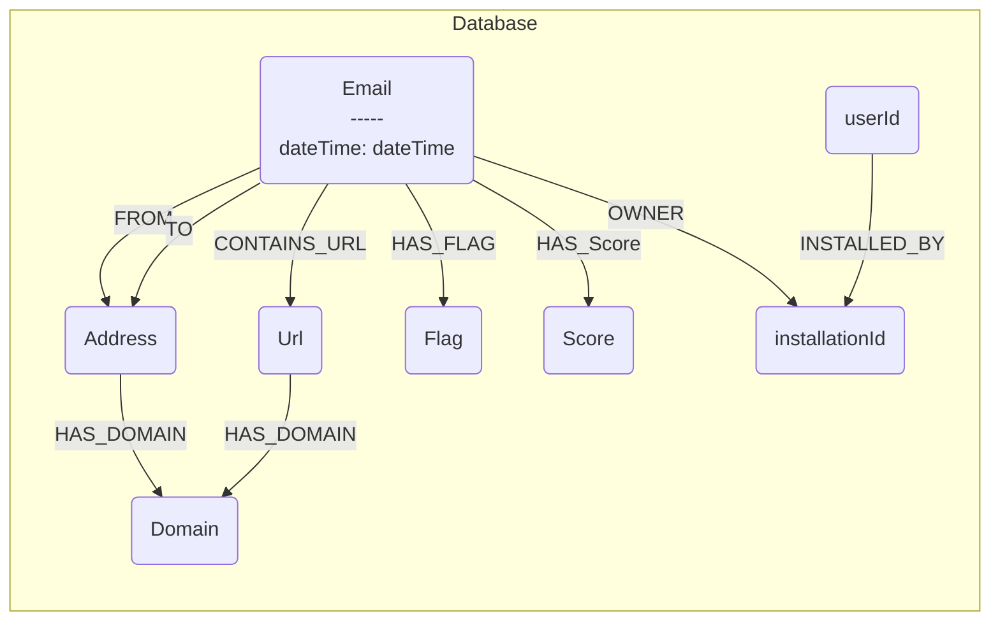
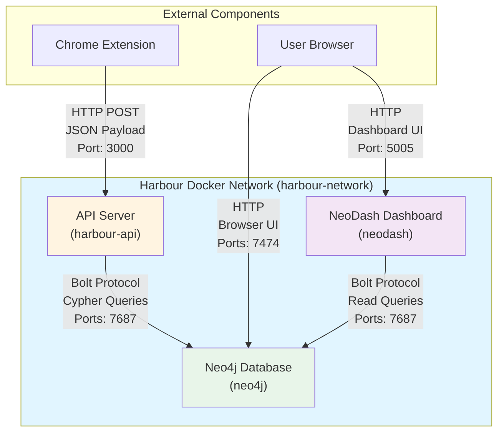

# Harbour

Harbour serves as the centralized database for collecting data from the rest of the product.

## Overview

Harbour runs a Neo4j graph database instance and an API server using Docker Compose. The database acts as the central data collection point for the application, and the API server translates JSON payloads from the Chrome extension into Neo4j graph operations.

## Database Configuration

The Neo4j database is configured with:

- **Image**: `neo4j:latest`
- **Container Name**: `neo4j`
- **Ports**:
  - `7474`: HTTP interface (Neo4j Browser)
  - `7687`: Bolt protocol (database connections)
- **Plugins**: APOC (Awesome Procedures on Cypher)
- **Volumes**:
  - `neo4j_data`: Persistent data storage
  - `neo4j_logs`: Log files
- **Restart Policy**: `unless-stopped`

## Database Schema

The following diagram illustrates the Neo4j graph database schema structure:



## Environment Variables

The database credentials are loaded from the `.env` file in the project root:

- `NEO4J_USERNAME`: Neo4j username
- `NEO4J_PASSWORD`: Neo4j password

These are used to configure `NEO4J_AUTH` in the format `${NEO4J_USERNAME}/${NEO4J_PASSWORD}`.

## Services

Harbour includes three services:

1. **Neo4j Database**: Graph database for storing email data
2. **NeoDash Dashboard**: Visualization dashboard for Neo4j
3. **API Server**: REST API for receiving data from Chrome extension

## Architecture & Component Communication

Harbour is built as a microservices architecture using Docker Compose, with all services connected via a shared Docker network. The following diagram illustrates how components are connected and communicate:



### Network Architecture

All Harbour services run within a Docker bridge network called `harbour-network`. This network enables:

- **Service Discovery**: Services can communicate using container names (e.g., `neo4j:7687`)
- **Isolation**: Services are isolated from other Docker networks
- **Internal Communication**: Services communicate internally without exposing ports externally (except where needed)

### Component Communication Flow

#### 1. Chrome Extension → API Server

**Protocol**: HTTP/REST  
**Port**: `3000` (exposed to host)  
**Endpoint**: `POST /api/emails`

The Chrome extension sends email data as JSON payloads to the API server:

```http
POST http://localhost:3000/api/emails
Content-Type: application/json

{
  "sender": "sender@example.com",
  "displayName": "Sender",
  "recipients": ["recipient@example.com"],
  "dateTime": "Thu 11/13/2025 4:46 PM",
  "attachments": [file.txt],
  "urls": ["https://example.com/link"],
  "flags": ["REQUESTING MONEY"],
  "score": 0.95,
  "installationId": "inst-001"
}
```

**Communication Details**:
- The API server uses Express.js with CORS enabled to accept cross-origin requests
- Requests are validated and processed asynchronously
- The API server responds with JSON containing the created email ID and status

#### 2. API Server → Neo4j Database

**Protocol**: Bolt (Neo4j's binary protocol)  
**Internal URI**: `bolt://neo4j:7687` (uses container name for service discovery)  
**External URI**: `bolt://localhost:7687` (for external clients)

The API server uses the `neo4j-driver` library to communicate with Neo4j:

**Connection Flow**:
1. API server creates a Neo4j driver instance using credentials from environment variables
2. For each email submission, the API server:
   - Opens a session with Neo4j
   - Executes Cypher queries to create/merge nodes and relationships
   - Closes the session after processing

**Key Operations**:
- `MERGE` operations to create nodes if they don't exist (idempotent)
- Relationship creation between nodes
- Transaction management for data consistency

**Service Discovery**: The API server connects to Neo4j using the container name `neo4j` instead of `localhost`, allowing Docker to resolve the service within the network.

#### 3. NeoDash → Neo4j Database

**Protocol**: Bolt  
**Connection**: `bolt://localhost:7687` (when accessed from host) or `bolt://neo4j:7687` (internal)

NeoDash connects to Neo4j to:
- Execute read-only Cypher queries for visualization
- Build interactive dashboards
- Display graph data in various chart formats

**Configuration**: NeoDash is configured via environment variables:
- `NEO4J_URI`: Connection string
- `NEO4J_USER`: Username
- `NEO4J_PASSWORD`: Password

#### 4. User Browser → Neo4j Browser

**Protocol**: HTTP  
**Port**: `7474` (exposed to host)  
**URL**: `http://localhost:7474`

Users can directly access Neo4j Browser to:
- Execute Cypher queries
- Visualize graph data
- Manage database schema

### Service Dependencies

The services have the following startup dependencies:

```
Neo4j Database (no dependencies)
    ↓
API Server (depends_on: neo4j)
NeoDash (depends_on: neo4j)
```

**Dependency Behavior**:
- Docker Compose ensures Neo4j starts before dependent services
- However, services should implement retry logic for database connections (currently the API server connects immediately on startup)
- If Neo4j is not ready, dependent services may fail to connect initially

### Data Flow: Email Submission

The complete data flow when a Chrome extension submits email data:

1. **Chrome Extension** → Sends HTTP POST request with JSON payload to `http://localhost:3000/api/emails`
2. **API Server** (`server.js`) → Receives request, validates payload
3. **API Server** (`neo4jService.js`) → Processes email data:
   - Generates unique email ID
   - Extracts domains from email addresses and URLs
   - Creates/merges nodes (Email, Address, Domain, Url, Flag, Score, etc.)
   - Creates relationships between nodes
4. **Neo4j Database** → Stores graph structure persistently
5. **API Server** → Returns success response with email ID
6. **Chrome Extension** → Receives confirmation

### Port Mapping

| Service | Internal Port | External Port | Protocol | Purpose |
|---------|--------------|---------------|----------|---------|
| Neo4j | 7474 | 7474 | HTTP | Neo4j Browser UI |
| Neo4j | 7687 | 7687 | Bolt | Database connections |
| API Server | 3000 | 3000 | HTTP | REST API endpoints |
| NeoDash | 5005 | 5005 | HTTP | Dashboard UI |

**Note**: Ports are mapped to the host machine, allowing external access. Internal communication between containers uses container names and internal ports.

### Environment Variable Sharing

All services share environment variables from the `.env` file in the project root:

- `NEO4J_USERNAME`: Shared across Neo4j, API Server, and NeoDash
- `NEO4J_PASSWORD`: Shared across Neo4j, API Server, and NeoDash
- `NEO4J_URI`: Used by API Server and NeoDash (defaults to `bolt://neo4j:7687`)

This ensures consistent authentication across all services.

## Accessing the UIs

Once the Docker stack is running, you can access the following interfaces:

### Neo4j Browser
- **URL**: `http://localhost:7474`
- **Purpose**: Interactive Cypher query interface and graph visualization
- **Login**: Use your Neo4j credentials from the `.env` file

### NeoDash Dashboard
- **URL**: `http://localhost:5005`
- **Purpose**: Low-code dashboard builder for creating interactive visualizations
- **Connection Settings**:
  - **URI**: `bolt://localhost:7687`
  - **Username/Password**: Use your Neo4j credentials from the `.env` file
- **Features**: Create dashboards with tables, graphs, bar charts, line charts, maps, and more

### Harbour API Server
- **URL**: `http://localhost:3000`
- **Purpose**: REST API endpoint for receiving email data from Chrome extension
- **Endpoints**:
  - `POST /api/emails`: Receive and process email data
  - `GET /health`: Health check endpoint
- **Documentation**: See `api/README.md` for detailed API documentation

## Setup

1. Ensure you have a `.env` file in the project root with the required credentials:
   ```
   NEO4J_USERNAME=your_username
   NEO4J_PASSWORD=your_password
   ```

2. Navigate to the Harbour directory:
   ```bash
   cd Harbour
   ```

3. Start the services:
   ```bash
   docker-compose up -d
   ```

4. Access the services:
   - Neo4j Browser: `http://localhost:7474`
   - NeoDash Dashboard: `http://localhost:5005`
   - Harbour API: `http://localhost:3000`

## Loading Test Data

To populate the database with sample test data that matches the schema:

1. **Using Neo4j Browser** (Recommended):
   - Open Neo4j Browser at `http://localhost:7474`
   - Copy the contents of `test-data.cypher`
   - Paste into the query editor and execute

2. **Using cypher-shell** (Command Line):
   ```bash
   docker exec -i neo4j cypher-shell -u ${NEO4J_USERNAME} -p ${NEO4J_PASSWORD} < test-data.cypher
   ```

The test data includes:
- 5 sample emails with various risk levels
- Multiple addresses, domains, and URLs
- Flags and scores for phishing detection
- User and installation relationships

## Stopping the Database

To stop the database:
```bash
docker-compose down
```

To stop and remove volumes (⚠️ **WARNING**: This will delete all data):
```bash
docker-compose down -v
```

