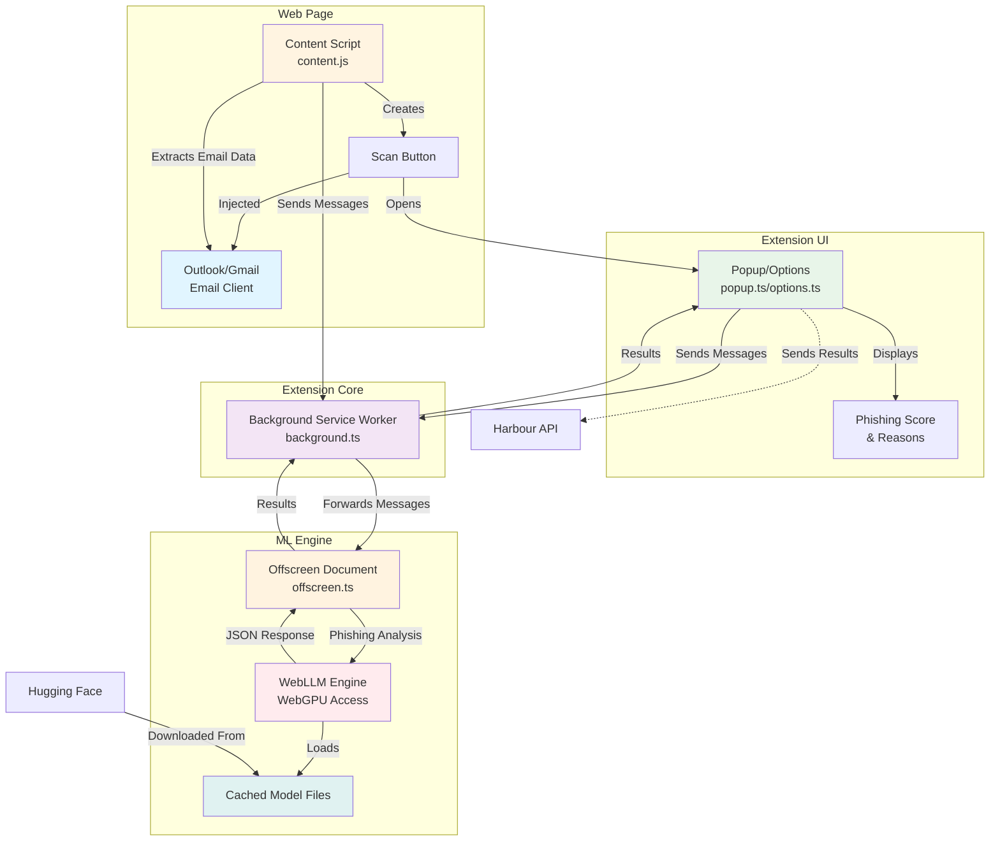

# WebLLM Chrome Extension


## Architecture



### Component Overview

- **Content Script** (`content.js`): Injected into web pages, detects email clients (Outlook/Gmail), extracts email metadata, and injects scan buttons
- **Popup/Options** (`popup.ts`, `options.ts`): User interface for initiating scans and displaying phishing detection results
- **Background Service Worker** (`background.ts`): Message router that manages the offscreen document and forwards communication between UI and ML engine
- **Offscreen Document** (`offscreen.ts`): Hosts the WebLLM engine with WebGPU access for model inference (required for WebGPU in Chrome extensions)
- **Model Files**: Bundled LLM model (default: Qwen3-0.6B-q4f16_1-MLC) stored in `src/models/` and copied to `dist/models/` during build

## Default Model

The extension is configured via `model-config.json` (at the project root) to use **Qwen3-0.6B-q4f16_1-MLC** as the default model for phishing email detection. To switch to another model, edit that single config file — every script and the UI will update automatically. The selected model is bundled with the extension and does not require internet download at runtime.

## Setup

### Quick Start (Recommended)

For a complete setup in one command:

```bash
npm run setup
```

This will:
1. Install all npm dependencies
2. Download the model files (requires Python with `huggingface_hub`)
3. Build the extension

### Manual Setup

#### 1. Install Dependencies

```bash
npm install
```

#### 2. Download Model Files

The model files need to be downloaded and placed under `src/models/<modelName>/` (the folder is determined by `model-config.json`):

**Option A: Using download script (requires Python)**
```bash
# Install Python's huggingface_hub if not already installed
pip install huggingface_hub

# Download model
npm run download-model
```

**Option B: Manual download**
1. Visit the Hugging Face repo from `model-config.json` (default: https://huggingface.co/mlc-ai/Qwen3-0.6B-q4f16_1-MLC)
2. Click "Files and versions" tab
3. Download all files (or use the "Download repository" button)
4. Extract all files to `src/models/<modelName>/`

Required files include:
- `mlc-chat-config.json`
- `params_shard_*.bin` (model weight files)
- `tokenizer.json`
- `tokenizer_config.json`
- Other model artifacts

#### 3. Build Extension

```bash
npm run build
```

**Note:** The build will fail if model files are missing. Make sure to download the model first!

This will create a new directory at `chrome-extension/dist/` with the model files included.

### 4. Load Extension in Chrome

1. Go to Extensions > Manage Extensions
2. Make sure developer mode toggle is selected
3. Select Load Unpacked
4. Add the `chrome-extension/dist/` directory

The extension will now use the bundled model without requiring internet download!

## Model Files

Model files are stored in `src/models/<modelName>/` (model name comes from `model-config.json`) and are excluded from git (see `.gitignore`). They are automatically copied to `dist/models/` during the build process and bundled with the extension.

### Build Process

The build process includes:
1. **Pre-build check**: Verifies model files exist before building (runs `scripts/check-model.js`)
2. **Build**: Parcel bundles the extension
3. **Post-build copy**: Ensures model files are copied to `dist/models/` (runs `scripts/copy-models.js` as a backup in case Parcel doesn't copy them automatically)

If model files are missing, the build will fail with clear instructions on how to download them.
